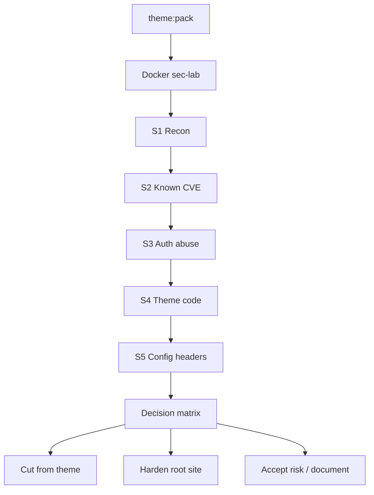

Ниже — **Security Gate** в том же формате, что org-verify: Docker-лаборатория, где вы **атакуете свой же стек**, чтобы решить что урезать в теме, что выключать на «корневом» сайте конструктора, какие заголовки/логин/лимиты ставить по умолчанию.

Lightspeed — отдельный чеклист. Здесь только **поиск уязвимостей и слабых мест**.

---

## Разделение ответственности (важно)

| Слой | Что ломаем | Решение продукта |
|------|------------|------------------|
| **A. Theme box** (`themes/latte` zip) | XSS, CSRF, IDOR в теме, утечки в шаблонах, опасный PHP | урезать/не класть в тему |
| **B. Site baseline** (корневой WP инстанс конструктора) | enum users, xmlrpc, REST, login brute, headers, files | mu-plugin / `wp-config` / server defaults |
| **C. Supply chain** | CVE core/plugins/themes, Composer deps | pin + scan + не тащить лишнее |
| **D. Runtime/host** | Apache/PHP misconfig, uploads, debug | Docker prod profile ≠ dev |

Тема **не должна** тащить WAF/login-limit как «плагин-территорию» на .org — но **корневой сайт / starter stack конструктора** может и должен.



---

## Лаборатория Docker (`sec-lab` profile)

Отдельный compose-профиль, **не** ваш текущий `WORDPRESS_DEBUG=1` dev:

```text
services:
  wordpress-sec   # WP без monorepo bind (только dist zip)
  db-sec
  wpcli-sec
  wpscan          # wpscanteam/wpscan
  nuclei          # projectdiscovery/nuclei
  zap             # owasp/zap2docker (опц.)
  attacker        # curl/httpx/ffuf для ручных сценариев
```

Правила лаборатории:

1. Цель только `http://wordpress-sec` в docker network — не чужие сайты.
2. Два режима: **vanilla WP + latte zip** и **vanilla + recommended plugins** (если конструктор их предлагает).
3. Снапшот БД до/после атак (`wp db export`).
4. Отчёт → `dist/latte.sec-report.json` + markdown с severity.

Команда-оркестратор (идея): `bun run theme:sec -- latte`.

---

## S1 — Recon (что видно снаружи)

Цель: карта атаки без эксплойтов — только discovery.

| Проверка | Инструмент / как | Слабое место если… | Решение |
|----------|------------------|--------------------|---------|
| Версия WP | WPScan / `generator` / readme.html | версия светится | убрать `generator`, удалить `readme.html`, `license.txt` |
| Тема/плагины fingerprint | WPScan `-e t,p` / CSS-hash | slug+version публичны | ок для темы; не светить unused plugins |
| User enum | `?author=1`, REST `/wp/v2/users`, WPScan `-e u` | логины перечисляются | ограничить REST users, запретить author enum |
| Registration | `/wp-login.php?action=register` | открыта | `users_can_register=0` |
| XML-RPC | `system.listMethods` | жив | отключить xmlrpc (mu-plugin / server) |
| REST API surface | `/wp-json/` index | лишние routes | disable unused; auth на sensitive |
| Directory listing | `/wp-content/uploads/`, `/themes/` | listing on | `Options -Indexes` |
| Sensitive files | `wp-config.php.bak`, `.env`, `debug.log`, `composer.json` в webroot | 200 OK | не деплоить; deny rules |
| Cron | `wp-cron.php` unauthenticated hammer | DoS/load | `DISABLE_WP_CRON` + system cron |
| Login URL | `/wp-login.php`, `/wp-admin/` | стандартный путь | сменить только на **site baseline** (не в .org теме) |

**Автомат:** WPScan enumerate + nuclei `wordpress-detect` / exposure templates + простой ffuf wordlist на backup files.

---

## S2 — Known vulnerabilities (CVE / Wordfence DB)

| Цель | Инструмент | Fail criteria |
|------|------------|---------------|
| Core | WPScan `--api-token` + enumerate | любой high/critical CVE на установленной версии |
| Plugins (если есть) | WPScan `-e vp,ap` aggressive (в lab) | vulnerable plugin present |
| Themes | WPScan `-e vt` | CVE в bundled/parent |
| Composer (тема) | `composer audit` в `themes/latte` | known advisory |
| JS deps (если появятся) | `bun audit` / npm audit | high+ |
| Nuclei WP templates | `nuclei -t http/cms/wordpress` + wordfence community sets | matched CVE/misconfig |

**Решение продукта:**

- Конструктор пинит **минимальный** WP version + PHP.
- В «корневой сайт» **ноль** плагинов по умолчанию; любой recommended plugin проходит S2 gate.
- Тема не вендорит устаревший Latte/UI8Kit без `composer audit` в CI.

---

## S3 — Auth & session abuse (попытка «взломать вход»)

Без написания кастомных эксплойтов — стандартные abuse-сценарии против своей lab.

| Атака | Как гоняем в Docker | Что измеряем | Hardening decision |
|-------|---------------------|--------------|--------------------|
| Password spray / brute | WPScan `--passwords` + маленький wordlist на `admin` | успех / lockout | login rate limit (mu-plugin / Fail2ban / nginx limit) |
| XML-RPC multicall brute | проверка что xmlrpc принимает auth flood | RPS без лимита | disable xmlrpc |
| Application passwords / REST auth | если включено | утечка scope | выкл. если не нужно |
| Cookie flags | DevTools / curl `-I` после login | нет `HttpOnly`/`Secure`/`SameSite` | HTTPS + cookie hardening |
| Privilege checks | subscriber session → admin URLs / theme options | 200 на admin | capability checks (тема: только `edit_theme_options` где надо) |
| CSRF на theme actions | если появятся `admin_post_` / AJAX | нет nonce | nonce + capability (тема) |
| Password reset host header | классический Host-header poison test | reset link на attacker host | доверять только каноническому host |

**Для конструктора:** отдельный mu-plugin `wpfasty-secure-baseline` (не в theme zip для .org):

- disable xmlrpc  
- limit login attempts  
- hide/disable user enumeration  
- optional custom login path (site-level)  
- force strong passwords policy hint  

Тема .org остаётся тонкой; **безопасность входа — site layer**.

---

## S4 — Theme attack surface (ваш код)

Это то, что решает «урезать из коробки» в Latte/конструкторе.

### 4.1 Static (CI, без Docker)

| Паттерн | Риск | Действие |
|---------|------|----------|
| Echo `$_GET/POST` без escape | XSS | запрет; только ContextFactory + Latte auto-escape |
| `|noescape` на user content | stored XSS | allowlist: только WP-sanitized HTML (`the_content` filters) |
| `eval`, `create_function`, `assert` | RCE | ban в PHPCS custom sniff |
| `unserialize(` user input | object injection | ban |
| `file_get_contents/curl` remote URL | SSRF | ban в теме |
| `shell_exec` / backticks | RCE | ban |
| SQL без `$wpdb->prepare` | SQLi | ban (тема и так не должна писать SQL) |
| AJAX/REST без `check_ajax_referer` + caps | CSRF/IDOR | если добавите endpoints — gate |
| Open redirect `wp_redirect($_GET['url'])` | phishing | ban |
| Uploads / file write | webshell | тема не пишет в FS кроме cache Latte |
| Secrets in repo | leak | `.env`, keys в zip audit |

Инструменты: PHPCS + custom security ruleset, Semgrep/Psalm taint (опц.), `composer audit`.

### 4.2 Dynamic (Docker + Theme Unit content)

| Сценарий | Как | Pass |
|----------|-----|------|
| XSS в title/content/comment fields | импорт Unit Test + payload posts (свои фикстуры) | payload как текст, не исполняется |
| XSS в search `/?s=<script>` | reflected | escaped в search form/archive title |
| XSS в author/bio/menu titles | | escaped |
| Attribute breakout | `"` в title в `href`/`aria-*` | Latte escape |
| Latte cache poisoning | writable cache dir from web | cache вне webroot или `0755` + no PHP exec |
| Debug leak | `WP_DEBUG_DISPLAY` на «prod» profile | display off; log only |
| Path disclosure | намеренный 500 | нет full paths в HTML |

### 4.3 Что уже хорошо у вас (не ломать)

- Нет comments/PII forms → меньше stored XSS / spam surface  
- Нет CPT/shortcodes/plugin territory → меньше attack surface  
- Context только из PHP → правильная модель  
- `|noescape` только для доверенного HTML WP — держать под ревью  

**Урезать из коробки (кандидаты):**

- любой будущий «demo import», remote URL fetch  
- admin notice без capability (у вас уже `switch_themes`)  
- лишние REST/AJAX «удобства»  
- app-shell JS: не eval’ить HTML из URL; sheet только DOM API  
- не светить `composer`/`vendor` listing; в zip — только нужное  

---

## S5 — Headers, PHP, server (site baseline)

Проверка: `curl -I` + securityheaders.com-логика в CI.

| Заголовок / настройка | Зачем | Где ставить |
|------------------------|-------|-------------|
| `X-Frame-Options` / CSP `frame-ancestors` | clickjacking | server / mu-plugin |
| `X-Content-Type-Options: nosniff` | MIME sniff | server |
| `Referrer-Policy` | leak URLs | server |
| `Permissions-Policy` | camera/mic | server |
| `Content-Security-Policy` | XSS brake | осторожно с WP admin; start report-only |
| Remove `X-Powered-By` | fingerprint | PHP `expose_php=Off` |
| `Server` tokens | fingerprint | Apache/nginx |
| HTTPS + HSTS | MITM | prod only |
| `DISALLOW_FILE_EDIT` | theme/plugin editor RCE path | wp-config baseline |
| `DISALLOW_FILE_MODS` (опц. managed) | | hosting mode |
| `FORCE_SSL_ADMIN` | | prod |
| PHP `display_errors=Off` | | prod image |
| Uploads: no PHP exec | webshell | `.htaccess` in uploads |
| DB user least privilege | | Docker prod secrets |

**Dev vs prod:** текущий compose с `WORDPRESS_DEBUG=1` и дефолтными паролями `wp/wp` — **только lab**. Sec-lab должен стартовать с сильными секретами и debug off.

---

## Decision matrix (выход чеклиста)

Каждый finding → одна из корзин:

| Корзина | Примеры | Владелец |
|---------|---------|----------|
| **CUT_THEME** | remote fetch, shortcode, unsafe `noescape`, file write | theme-builder / presets |
| **SITE_DEFAULT_OFF** | xmlrpc, user enum, registration, file editor, generator | `wpfasty-secure-baseline` mu-plugin |
| **SITE_DEFAULT_ON** | login rate limit, `DISALLOW_FILE_EDIT`, indexes off, security headers | same + server conf |
| **OPTIONAL_HARD** | custom login slug, 2FA, CSP enforce, WAF | плагин/хостинг, не .org theme |
| **ACCEPT** | тема видна в HTML (норма), REST index для Gutenberg | document in security.md |
| **PERF_LATER** | тяжёлые scanners в CI — квоты; не путать с lightspeed | отдельный чеклист |

Так вы отделяете: **безопасная тема** vs **безопасный сайт, который крутит тему**.

---

## Автоматизация в том же духе, что org-verify

```text
bun run theme:sec -- latte
  S0  pack zip (reuse)
  S1  recon          → wpscan -e u,t,p + nuclei exposure
  S2  cve            → wpscan api + composer audit + nuclei cve
  S3  auth-abuse     → limited brute + xmlrpc probe + cookie flags
  S4a static-theme   → phpcs-security + semgrep rules
  S4b dynamic-xss    → fixture payloads + HTTP asserts
  S5  headers/config → curl -I scorecard
  → sec-report.md + fail on HIGH/CRITICAL
```

CI:

- PR: S4a + composer audit (быстро)  
- Nightly / `workflow_dispatch`: полный Docker sec-lab (S1–S5)  
- Release: sec-lab green обязателен перед `theme:pack` publish  

---

## Практический «порядок взлома» своей lab (ручной день)

1. Поднять sec-lab, поставить только `dist/latte.zip`.  
2. WPScan full enumerate + API token.  
3. Nuclei wordpress + misconfig.  
4. Проверить enum: author, REST users, xmlrpc.  
5. Малый password list на login + xmlrpc.  
6. Пройти XSS-фикстуры (search, title, content).  
7. `curl -I` headers score.  
8. Заглянуть в `wp-content/uploads`, cache Latte, `debug.log`.  
9. Заполнить decision matrix → backlog CUT/SITE.  

---

## Что не класть в .org theme (даже если «безопасно»)

По правилам ревью это plugin territory / не презентация:

- login limiter, 2FA, captcha  
- security headers mu-plugin  
- hide login URL  
- firewall / ban IP  

Их место: **корневой сайт конструктора / hosting blueprint / optional “Secure stack” preset**, рядом с темой, не внутри zip для директории.

---

## Минимальный контракт отчёта

```text
theme:sec latte
  recon ........ 3 findings (user enum, xmlrpc, generator)
  cve .......... PASS (core pinned, no vulnerable plugins)
  auth ......... FAIL (no rate limit) → SITE_DEFAULT_ON
  theme-static . PASS
  theme-dynamic PASS (0 XSS)
  headers ...... WARN (no CSP) → SITE_DEFAULT_ON / OPTIONAL
Decision:
  CUT_THEME: none
  SITE_DEFAULT_OFF: xmlrpc, user enum, file editor
  SITE_DEFAULT_ON: login limit, security headers, DISALLOW_FILE_EDIT
→ theme OK for .org; site baseline required for production
```

---

## Связь с lightspeed (на будущее, не смешивать)

Sec-gate может **порождать** perf-долг (лишние плагины безопасности). Правило конструктора:

1. Сначала **убрать поверхность** (CUT / DEFAULT_OFF) — это и security, и скорость.  
2. Потом тонкий baseline (headers, rate limit) — дёшево.  
3. Тяжёлый WAF/сканеры — только OPTIONAL_HARD, вне critical path lightspeed.

---

Если дальше нужно — в Agent mode можно набросать `docker-compose.sec.yml` + скелет `theme:sec` и decision-matrix шаблон под `latte`. Сейчас Ask mode: только дизайн.