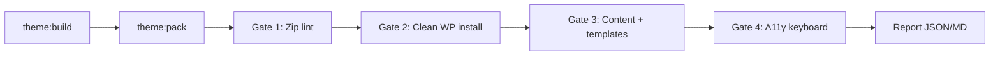

Идея: один пайплайн `theme:verify -- <id>` поверх уже существующих `theme:pack` + Docker + PHPUnit. Ниже — слои от дешёвых статических проверок до «почти ревьюер».

---

## Архитектура: 4 гейта



Цель конструктора: любой preset (`latte`, будущие темы) проходит один и тот же контракт, без ручного чеклиста.

---

## Gate 1 — Zip / packaging (без WordPress)

Самое дешёвое и 100% CI-friendly. Расширить `theme-builder pack` или отдельный `theme:audit-zip`.

| Проверка | Как |
|----------|-----|
| Только тема в корне zip | Список файлов: нет `.git`, `.cursor`, `node_modules`, monorepo paths |
| Обязательные файлы | `style.css`, `readme.txt`, `LICENSE`, `screenshot.png`, `functions.php` |
| Forbidden extensions | `.xml` (кроме whitelist), `.sh`, `.sql`, `thumbs.db`, zip-in-zip — по [Required §9](https://make.wordpress.org/themes/handbook/review/required/) |
| Screenshot | sharp/ImageMagick: ≤1200×900, ratio ≈ 4:3 (±1%) |
| `style.css` headers | parse: Version, Requires, Tested up to, Text Domain = folder slug |
| Tags honesty | deny-list: `accessibility-ready` если в манифесте `a11y.focusTrap !== true`; `e-commerce` без Woo feature |
| Resources coverage | сканировать `assets/**` + `lib/**` + vendor names → каждый должен упоминаться в `readme.txt == Resources ==` |
| Policy scan | ripgrep по теме: `register_post_type`, `add_shortcode`, `woocommerce`, `comments_template`, contact-form patterns → fail или warn по policy-профилю |
| Minified sources | если есть `*.min.js/css` — рядом должен быть unminified twin (правило Theme Check) |

**Выход:** `dist/latte.audit.json` + exit code ≠ 0 при required fail.

Это идеально для конструктора: правила живут в `presets/themes/<id>.json` (`features`, `policy`, `orgTags`).

---

## Gate 2 — Clean WP + Theme Check (Docker)

У вас уже есть `dev:up`. Добавить ephemeral job, не портящий dev-volume:

```bash
# псевдо
bun run theme:org-check -- latte
```

Внутри:

1. Поднять одноразовый контейнер (`wp-cli` + PHP + MySQL) или `wp-env` / `wordpress-develop` fixture.
2. `wp theme install dist/latte.zip --activate` (именно zip, не bind-mount monorepo).
3. `wp plugin install theme-check --activate`.
4. Запуск Theme Check headless:
   - WP-CLI: `wp eval-file tools/run-theme-check.php` (обёртка над Theme Check API), или
   - [Theme Check CLI](https://github.com/WordPress/theme-check) / `wp theme-check` если доступен.
5. Парсить required vs recommended → fail только на required.
6. `WP_DEBUG=1`, `WP_DEBUG_DISPLAY=1`, `WP_DEBUG_LOG=1` в wp-config тестового инстанса.

**Конструкторный плюс:** один образ `wpfasty/org-gate` переиспользуется для всех сгенерированных тем.

---

## Gate 3 — Theme Unit Test + template matrix

### 3a. Импорт (автомат)

```bash
wp plugin install wordpress-importer --activate
wp import https://raw.githubusercontent.com/WordPress/theme-test-data/master/themeunittestdata.wordpress.xml --authors=create
```

Кэшировать XML в `tools/fixtures/themeunittestdata.wordpress.xml` (не класть в theme zip!), чтобы CI не зависел от GitHub raw.

### 3b. HTTP smoke по типам страниц (H7)

Таблица URL → ожидания:

| Тип | Как получить URL | Assert |
|-----|------------------|--------|
| front | `wp option get show_on_front` + page | 200, `wp_body_open` marker / `</html>` |
| home/blog | posts page | 200 |
| single | первый post | `post_class`, title |
| page | About | 200 |
| category/tag/author | term/user from import | archive header |
| search | `/?s=hello` | search form |
| 404 | `/this-does-not-exist-xyz` | 404 view |
| attachment | media from import | attachment block |

Реализация: PHPUnit integration (`HttpSmokeTest`) через `wp-cli eval` + curl, или Playwright `request.get`.

### 3c. Notice hunter

Для каждого URL:

```bash
curl -s URL | tee /tmp/out.html
# параллельно tail debug.log
```

Fail если в `debug.log` появились `Notice`/`Warning`/`Deprecated` с путём темы. Это закрывает «WP_DEBUG clean».

---

## Gate 4 — Keyboard / a11y (частично автомат)

Полный human review не заменить, но 80% чеклиста — да.

| Шаг | Инструмент |
|-----|------------|
| Skip link first focusable | Playwright: `Tab` → focus на `.skip-link`, Enter → `#content` |
| Primary nav reachable | Tab через desktop nav links |
| Mobile sheet | viewport mobile → open button → `aria-expanded` / dialog visible → Escape/close |
| Search focusable | Tab до `input[name=s]` |
| axe-core | `@axe-core/playwright` на front/single/archive — fail на critical/serious |
| Focus visible | computed outline/box-shadow ≠ none на focused controls |

Хранить сценарии в `tools/e2e/org-a11y.spec.ts`, параметр `--theme=latte`.

**Честно пометить:** `accessibility-ready` tag всё равно только после ручного/расширенного a11y suite (focus trap в sheet и т.д.) — в Gate 1 tag остаётся blocked.

---

## Policy / privacy (статический профиль)

В preset:

```json
{
  "org": {
    "target": "wordpress.org",
    "exclude": ["woocommerce", "fse", "comments-ui", "rtl", "cpt", "shortcodes", "contact-forms"],
    "require": ["gpl", "privacy-readme", "comments-disabled"]
  }
}
```

Автопроверки:

- `readme.txt` содержит Privacy / comments FAQ
- PHP: `comments_open` filter / нет `comments_template`
- нет `register_post_type` / `add_shortcode`
- LICENSE + Resources секция не пустая
- Contributors = один wp.org username (когда появится)

---

## Как встроить в конструктор

| Слой | Команда | Где |
|------|---------|-----|
| Unit | `bun run test` | уже есть |
| Zip lint | `bun run theme:audit -- latte` | theme-builder / `tools/org-gate` |
| Org Docker | `bun run theme:org-check -- latte` | compose profile `org-gate` |
| E2E a11y | `bun run theme:e2e -- latte` | Playwright |
| All | `bun run theme:verify -- latte` | orchestrator: build→pack→audit→org→e2e |

CI matrix:

```yaml
verify:
  - theme: latte
  # later: latte-skin only pack-skip / child rules
```

Отчёт в артефакт: `org-report.md` с чеклистом ✅/❌ — удобно для PR и для будущего UI конструктора.

---

## Приоритеты внедрения (ROI)

1. **P0 — Zip lint + Resources/tags/screenshot** — день работы, ловит половину .org rejects, без Docker.
2. **P0 — Pack → install zip in Docker + Theme Check CLI** — главный «required errors = 0».
3. **P1 — Unit Test XML import + URL matrix + debug.log** — закрывает H7 content.
4. **P1 — Playwright skip/sheet/search** — закрывает keyboard минимум.
5. **P2 — axe-core + policy scanner из preset** — масштабируется на N тем конструктора.
6. **P3 — Dashboard в theme-builder** (`verify` status per theme id) — продукт конструктора.

---

## Чего не автоматизировать (оставить manual gate)

- Субъективный screenshot «не реклама»
- Полный accessibility-ready (focus trap, screen reader narrative)
- Trademark / naming review
- «Тема ощущается законченной» для human reviewer

В отчёте явно: `manual: screenshot taste, a11y-ready claim`.

---

## Минимальный контракт для конструктора

Каждая тема после `pack` должна уметь ответить:

```text
theme:verify <id>
  unit ........ PASS
  zip ......... PASS (0 required)
  theme-check . PASS (0 required, N recommended)
  templates ... PASS (10/10 URLs, 0 debug notices)
  keyboard .... PASS (4 scenarios)
  policy ...... PASS (org profile)
→ READY FOR UPLOAD
```

Если нужно, в Agent mode можно набросать скелет `tools/org-gate` + compose profile и первый `theme:audit` (Gate 1) — это самый быстрый win.