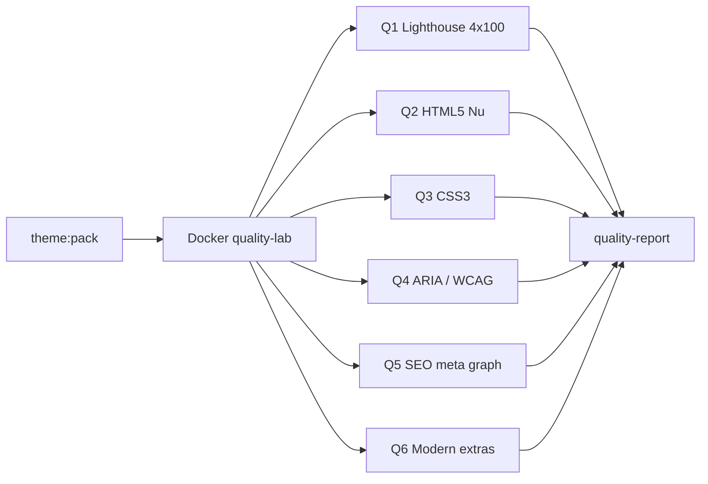

Ниже — **Quality Gate** (`theme:quality`) в том же духе: Docker-лаборатория, URL-матрица, пороги 0–100, решение что чинить в теме / в site baseline / принять.

«Lightspeed 4/100» читаю как **Lighthouse: 4 категории × score 0–100** (Performance, Accessibility, Best Practices, SEO). Если имелся в виду LiteSpeed server — это отдельный hosting-слой; здесь — **скорость страницы + стандарты разметки**.

---

## Карта гейтов (рядом с org + sec)



Команда-идея: `bun run theme:quality -- latte`  
Отчёт: `dist/latte.quality-report.json` + markdown.

---

## Лаборатория Docker (`quality-lab`)

Отдельно от `WORDPRESS_DEBUG=1` (debug раздувает HTML/JS и убивает Perf):

| Сервис | Роль |
|--------|------|
| `wordpress-quality` | WP + только `dist/<theme>.zip`, **prod-like**: debug off, object-cache optional off |
| `wpcli` | activate theme, import Unit Test / starter URLs |
| `lhci` / Chrome | Lighthouse CI (mobile + desktop) |
| `vnu` | Nu Html Checker (W3C HTML5) — образ `ghcr.io/validator/validator` |
| `css-validator` или `stylelint` | CSS3 / modern CSS |
| `playwright` + axe | ARIA/WCAG (глубже, чем Lighthouse a11y) |
| опц. `unlighthouse` | crawl всего сайта одним прогоном |

Важно для честных цифр:

1. Греть 2–3 прогона Lighthouse, медиана.  
2. Mobile-first как gate (desktop — informative).  
3. Одинаковый набор URL для всех Q*.  
4. Не сканировать wp-admin (другой мир).

**URL matrix (минимум):**

| ID | URL |
|----|-----|
| front | `/` |
| blog | posts page |
| single | один post с картинкой |
| page | About |
| archive | category |
| search | `/?s=test` |
| 404 | missing slug |

---

## Q1 — Lightspeed / Lighthouse (4 × 100)

Инструмент: **Lighthouse CI** в Docker (`--chrome-flags="--no-sandbox"`).

| Категория | Целевой порог (тема) | Строгий (prod site) | Что обычно ломает WP-тему |
|-----------|----------------------|---------------------|---------------------------|
| **Performance** | ≥ 90 mobile (warn &lt; 90, fail &lt; 70) | ≥ 95 | CSS/JS вес, нет compression, огромный screenshot hero, render-blocking, нет width/height у img |
| **Accessibility** | ≥ 95 (fail &lt; 90) | ≥ 100 intent | contrast, labels, heading order, aria на sheet |
| **Best Practices** | ≥ 95 | ≥ 95 | console errors, deprecated APIs, insecure requests |
| **SEO** | ≥ 90 | ≥ 95 | title, meta description, crawlable links, viewport |

### Core Web Vitals (внутри Perf) — отдельные asserts

| Метрика | Good | Fail gate |
|---------|------|-----------|
| LCP | ≤ 2.5s | &gt; 4s |
| INP / TBT proxy | low TBT | высокий TBT от JS |
| CLS | ≤ 0.1 | &gt; 0.25 |
| FCP | ≤ 1.8s | informative |
| Speed Index | — | informative |

### Decision → что урезать в теме vs сайте

| Finding | CUT_THEME / fix in theme | SITE_BASELINE |
|---------|--------------------------|---------------|
| Огромный `theme.min.css` | trim utilities, split critical | Brotli/gzip, HTTP/2 |
| Нет `width`/`height` / CLS | Image primitive всегда sizes | CDN images |
| Render-blocking CSS | critical CSS / defer non-critical | LiteSpeed/nginx cache |
| Лишний JS (`ui8kit.js` на всех) | load only if sheet/menu needs | combine/minify at host |
| Нет lazy images below fold | `loading="lazy"` в Image | — |
| Fonts | system или `font-display: swap`, self-host | preload |
| jQuery на фронте | **не тащить** в тему | dequeue если core тянет зря |

**Конструктор:** budgets в preset:

```json
"quality": {
  "lighthouse": {
    "performance": 0.90,
    "accessibility": 0.95,
    "bestPractices": 0.95,
    "seo": 0.90
  },
  "budgets": {
    "totalByteWeight": 500000,
    "scriptBytes": 80000,
    "stylesheetBytes": 60000
  }
}
```

Lighthouse CI `assert` на categories + resource budgets.

---

## Q2 — W3C HTML5 (Nu Html Checker)

Инструмент: **vnu.jar** / Docker `validator/validator`  
Режим: `vnu --format json URL` или pipe HTML из `curl`.

| Проверка | Severity | Типичные WP/Latte проблемы |
|----------|----------|----------------------------|
| Duplicate `id` (sheet trigger/title) | fail | classic vs app-shell IDs |
| Element not allowed where found | fail | `<div>` в `<p>`, interactive в heading |
| Stray close tag | fail | capture/include mistakes |
| Obsolete attributes | warn | `align`, `bgcolor` |
| Duplicate attribute | fail | |
| `role` conflicts with implicit | → Q4 | |

**Политика gate:**  
- `error` → fail  
- `info`/`warning` → warn (или fail на front+single only)

**Не валидировать** сырой `the_content` Unit Test как hard-fail всей темы — контент пользователя может быть кривым. Два режима:

1. **Theme chrome** — layout/header/footer/404 с контролируемым контентом → hard fail  
2. **Content pages** — Unit Test → report only / fail только на errors в theme wrappers (сложнее; проще: starter content pages)

---

## Q3 — W3C CSS3 / modern CSS

Два уровня (оба полезны):

| Уровень | Инструмент | Зачем |
|---------|------------|-------|
| **Syntax / CSS** | W3C CSS Validator API или `csstree` / Stylelint `stylelint-config-standard` | parse errors, unknown props |
| **Theme hygiene** | Stylelint + custom | !important abuse, unused huge sheets, invalid `@media` |

Для utility-CSS (Tailwind-like) W3C Validator часто шумит на современные функции (`oklch`, `@layer`, nesting). Практичный контракт конструктора:

| Правило | Gate |
|---------|------|
| Файл парсится (no fatal parse) | fail |
| Нет `expression()` / `behavior:` | fail |
| Tokens в `:root` валидны | fail |
| Vendor-only hacks без fallback | warn |
| Полный W3C CSS3 «0 warnings» на utility CSS | **не** делать hard-fail |

Отдельно: **critical CSS size** + **unused CSS** (Purge/coverage в Chrome) — это уже lightspeed, не W3C.

---

## Q4 — W3C ARIA / WCAG (не путать с Lighthouse a11y score)

Lighthouse a11y ≈ подмножество axe. Для темы нужен **axe-core** (Playwright/Pa11y).

| Стандарт | Инструмент | Порог |
|----------|------------|-------|
| WCAG 2.2 AA | axe `tags: wcag2a, wcag2aa, wcag21a, wcag21aa, wcag22aa` | 0 critical/serious |
| ARIA valid | axe aria-* rules + vnu ARIA | 0 errors |
| Name, Role, Value | axe | fail on serious |
| Keyboard (из org-gate) | Playwright | skip → nav → sheet → search |

### Чеклист ARIA именно для Latte chrome

| Компонент | Assert |
|-----------|--------|
| Skip link | first focusable, visible on focus, target `#content` |
| `<html lang>` | `{language_attributes}` |
| Landmarks | one `main`, header/footer/nav labelled |
| Mobile sheet | `role="dialog"`, `aria-modal`, `aria-labelledby`, focus trap (**пока нет trap — не ставить accessibility-ready**) |
| Buttons | `aria-expanded` на open, `aria-controls` |
| Search | `<form role="search">` + label/`aria-label` на input |
| Pagination / post nav | `aria-label` из `$labels` |
| Decorative icons | `aria-hidden="true"` |
| Images | alt (пустой только если decorative) |

**Связь с .org:** Q4 green ≠ право на tag `accessibility-ready`. Tag — только после focus-trap + manual SR pass.

---

## Q5 — SEO meta / social graph (опциональный профиль)

Тема .org **не должна** тащить SEO-плагин. Но конструктор может:

- проверять **что ядро/тема уже отдают**;  
- или optional `seo` feature в site stack.

| Проверка | Источник | Theme vs Site |
|----------|----------|---------------|
| `<title>` уникален | `title-tag` support | theme: support on; content: WP |
| meta description | часто плагин | **site/plugin**; тема может не ставить |
| canonical | WP rel_canonical | не вырезать (sec-gate!) |
| robots | | site |
| Open Graph `og:title/type/url/image` | Yoast/RankMath/или thin theme tags | optional site feature |
| Twitter Card | same | optional |
| `og:image` размер | ≥ 1200px wide recommend | media |
| JSON-LD `WebSite` / `Article` / `BreadcrumbList` | plugin or theme | optional; .org ok если presentational |
| hreflang | multilingual | out of scope RTL/i18n later |
| sitemap | wp-sitemap.xml | core on |
| RSS | feed links | theme support `automatic-feed-links` |

**Автомат:** парсер HTML на URL matrix:

```text
assert title present non-empty
assert meta viewport
assert exactly one h1 (warn if 0/2+)
assert og:* if profile.seo.social === true
assert json-ld parse if present
assert no noindex on public posts
```

Lighthouse SEO category уже ловит часть — Q5 глубже для graph/schema.

---

## Q6 — Что ещё важно современному сайту

Добавить как подгейты (не раздувая P0):

### Обязательно рядом с quality

| Область | Проверка | Зачем |
|---------|----------|-------|
| **Responsive** | Lighthouse mobile + Playwright viewports 360/768/1280 | modern default |
| **Images** | formats (webp/avif optional), srcset, aspect-ratio | LCP/CLS |
| **Privacy** | нет third-party trackers в теме; cookie banners = plugin | GDPR + .org |
| **Security headers** | overlap с sec-gate (informative здесь) | Best Practices |
| **HTTPS mixed content** | Lighthouse BP | |
| **Console clean** | no JS errors on matrix | BP + a11y |
| **Print / reduced-motion** | `@media (prefers-reduced-motion)` на анимациях | a11y modern |
| **Color scheme** | `prefers-color-scheme` / theme tokens | optional |
| **i18n** | `lang`, text domain, no hardcoded UI (кроме documented) | .org + a11y |
| **Structured errors** | 404 полезный, не soft-404 | SEO |

### Опционально (product presets)

| Область | Когда |
|---------|-------|
| PWA / manifest / SW | app-like sites — не default blog theme |
| AMP | устарело для большинства — skip |
| Favicon / app icons set | site identity |
| Open Graph preview (facebook debugger CI) | marketing sites |
| Broken links crawler | `lychee` / playwright | 
| Spellcheck UI strings | | 
| Visual regression | Playwright screenshots per block | constructor gold |
| Email HTML | out of scope |

### Performance beyond Lighthouse

| Проверка | Инструмент |
|----------|------------|
| TTFB | curl timing / Lighthouse server-side |
| Cache-Control / ETag | headers on static assets |
| Third-party weight | Lighthouse treemap |
| Fonts FOIT/FOUT | font-display |
| Critical request chain depth | Lighthouse |

---

## Сводка порогов (рекомендуемый контракт конструктора)

```text
theme:quality latte
  Q1 Lighthouse mobile (median of 3)
     Performance ...... ≥ 90   (fail < 70)
     Accessibility .... ≥ 95
     Best Practices ... ≥ 95
     SEO .............. ≥ 90
  Q2 HTML5 (chrome URLs) ...... 0 errors
  Q3 CSS parse / stylelint .... 0 errors
  Q4 axe WCAG 2.2 AA .......... 0 critical/serious
  Q5 SEO graph ................ optional profile
  Q6 responsive + console ..... pass
→ READY / FIX_THEME / FIX_SITE
```

---

## Decision matrix (как в sec)

| Корзина | Примеры |
|---------|---------|
| **FIX_THEME** | missing alt, bad heading order, huge CSS, CLS images, invalid HTML in layout, aria на sheet, contrast tokens |
| **FIX_SITE** | caching, compression, HTTP/2, SEO plugin meta, CDN, image optimization pipeline |
| **BUDGET_PRESET** | «marketing hero» theme допускает Perf ≥ 80; «blog lite» требует ≥ 95 |
| **ACCEPT** | Unit Test malformed content HTML; admin bar в logged-in lab (тестировать logged-out!) |
| **BLOCK_TAG** | не ставить `accessibility-ready` пока Q4 + focus-trap не green |

**Lab rule:** гонять quality **logged-out**, без admin bar — иначе Perf/HTML врут.

---

## Автоматизация в monorepo

```text
bun run theme:quality -- latte
  1. pack (reuse)
  2. quality-lab up + install zip
  3. seed URLs (starter or unit-test subset)
  4. parallel:
       lhci autorun
       vnu matrix
       stylelint assets/css
       playwright axe + keyboard smoke
       optional meta/og crawler
  5. merge → dist/latte.quality-report.md
```

CI:

| Когда | Что |
|-------|-----|
| PR | Q2 chrome HTML + Q3 stylelint + Q4 axe на front/single (быстро) |
| Nightly | полный Q1 mobile + URL matrix |
| Release | все Q1–Q4 hard gate |

---

## Порядок внедрения (ROI)

1. **P0** — Lighthouse CI mobile на front+single + budgets CSS/JS  
2. **P0** — axe на той же матрице (ARIA/WCAG)  
3. **P1** — vnu HTML на layout/404/search (контролируемый контент)  
4. **P1** — stylelint / CSS parse на `tokens.css` + theme CSS  
5. **P2** — SEO meta/OG profile (optional preset)  
6. **P2** — visual regression по блокам конструктора  
7. **P3** — Unlighthouse crawl + broken links  

---

## Связка трёх чеклистов продукта

| Gate | Вопрос |
|------|--------|
| `theme:org-check` | Пустят ли на WordPress.org? |
| `theme:sec` | Что урезать / выключить, чтобы не взломали? |
| `theme:quality` | Быстро ли, валидно ли, доступно ли, видно ли поисковикам/соцсетям? |

Итоговая формула конструктора:

```text
theme:verify = org + sec + quality
```

Lightspeed здесь = **Q1 budgets + FIX_THEME/FIX_SITE**, а не «поставить ещё один cache-плагин в тему».

Если нужно — следующим шагом в Agent mode можно набросать `docker-compose.quality.yml` + `.lighthouserc.js` с порогами под `latte`.